# Silsilah Sacra Scriptorium


**Typesetting Arabic and English works for the Islamic tradition.**

This project is a document factory for LaTeX publications. It provides a robust, automated pipeline to convert simple Markdown files—like those from an Obsidian vault—into beautifully typeset, high-quality PDFs using the power and elegance of LaTeX.

## The Workflow

This scriptorium is designed to be a "hands-off" factory. The core workflow is simple: write your content in a standardized format (Markdown) and let the automation handle the complex typesetting.

```mermaid
flowchart LR
    A[✍️ Write in Markdown] --> B{🐍 Run Python Script};
    C[📜 LaTeX Template] --> B;
    B --> D[⚙️ Pandoc & LaTeXmk];
    D --> E[📄 Final PDF];
```



1.  **Write Content:** Draft your articles, poetry, or compilations in Markdown for ease and speed.
2.  **Choose a Template:** Select the appropriate template for your document type (e.g., `article`, `hymn`).
3.  **Run the Script:** Execute the main Python script, pointing it to your source file and chosen template.
4.  **Generate PDF:** The script automatically converts Markdown to LaTeX, injects it into the template, and compiles the final PDF, placing it in the `published/` directory.

## Features

- **Template-Driven:** Easily create new document styles by adding new templates.
- **Bilingual Support:** Optimized for typesetting both English and Arabic text gracefully.
- **Markdown-Based:** Write content in a simple, portable format without worrying about LaTeX syntax.
- **Automated Pipeline:** Single-command PDF generation.
- **Centralized Asset Management:** `shared/` directory for common fonts, images, and styles.

## Project Structure

The repository is organized to separate concerns, keeping templates, scripts, and outputs clean and manageable.

```
.
├── build/                  # Temporary build files (ignored)
├── published/              # Final, published PDFs
├── scripts/                # Python automation scripts
│   └── publish-pdf.py
├── templates/              # LaTeX template packages
│   ├── article/
│   └── hymn/
├── shared/                 # Assets shared across all templates
├── my-article.md           # Example source file
└── references.bib          # Master bibliography file
```

## Getting Started

### Prerequisites

To use this document factory, you will need the following software installed on your system:

- Python 3.8+
- A full LaTeX distribution (e.g., [TeX Live](https://www.tug.org/texlive/), [MiKTeX](https://miktex.org/))
- [Pandoc](https://pandoc.org/installing.html) for Markdown-to-LaTeX conversion

### Installation & Usage

1.  **Clone the repository:**

    ```bash
    git clone <your-repo-url>
    cd silsilah-sacra-scriptorium
    ```

2.  **Set up the Python environment (optional but recommended):**

    ```bash
    python3 -m venv venv
    source venv/bin/activate
    # pip install -r requirements.txt # (If you create a requirements file)
    ```

3.  **Run the publishing script:**

    To compile a Markdown file, execute the `publish-pdf.py` script. You'll need to specify the template, the input file, and the desired output name.

    ```bash
    python scripts/publish-pdf.py \
      --template en-ar-template \
      --input "path/to/your/file.md" \
      --output "My Published Work.pdf" \
      --bib references.bib
    ```

    The final PDF will be saved to the `published/` directory.

## How to Create a New Template

1.  Create a new subdirectory inside the `templates/` folder (e.g., `templates/poetry/`).
2.  Inside the new folder, create your `template.tex` file.
3.  Use placeholders (e.g., `{{content}}`, `{{title}}`) in your `.tex` file where the Python script should inject content.
4.  Add any template-specific style files (`.sty`), fonts, or other assets into this new folder.
5.  You can now use this template by referencing its folder name with the `--template` flag (e.g., `--template poetry`).

## License

This project is licensed under the MIT License. See the `LICENSE` file for details.
